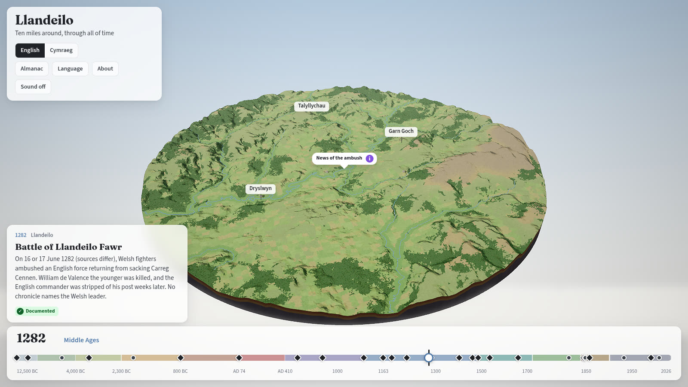
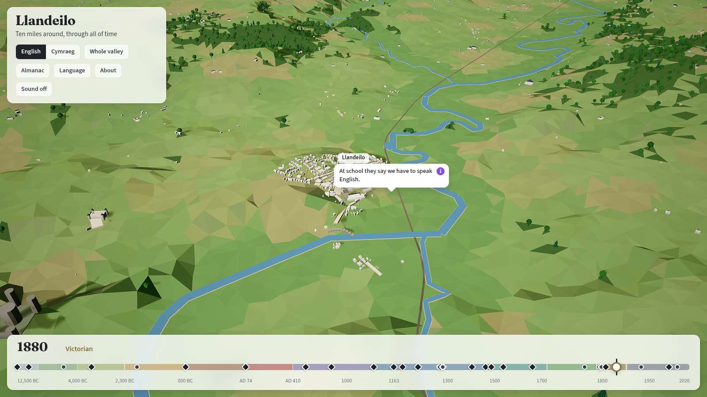

# Llandeilo Through Time

*Omnia mutantur, nihil interit*: everything changes, nothing perishes.

**Live: https://dewijones92.github.io/llandeilo-omnia-mutantur-nihil-interit/**

A 3D diorama of the real landscape within ten miles of Llandeilo, in the Tywi valley in
Carmarthenshire, that you move through time with a slider: from the tundra left by the last Ice
Age, through Iron Age hillforts, Roman forts, the castles of Deheubarth and the conquest of 1282,
to the Rebecca Riots, the railway and today.



## History first, invention always labelled

Everything on screen carries one of three labels, and you can hover or click it to see why:

- **Documented**: recorded in historical or archaeological sources, with those sources listed.
- **Reconstructed**: inferred from archaeology or from comparable places, with the basis stated.
- **Imagined**: invented to fill a gap (the conversations, a farmstead's exact spot), with what it
  is grounded in.

Where the sources disagree (the date of the 1282 battle, who led the Welsh, the size of the Roman
forts) the app says so rather than picking one. Where nothing is known, it says that too.



## What is in it

- The real terrain, rivers, buildings, railway, roads and woodland from Ordnance Survey OpenData.
- Around 30 key dates, 40 places and buildings that come and go through time, and an almanac for
  each period (food, clothing, homes, belief, money, health, travel, people, nature).
- How spoken language changed over time and by class, from unknown prehistoric speech to the 2021
  census.
- An imagined family that recurs through the centuries, with voiced conversations in the language
  of their time (translated), including one real line of medieval Welsh poetry.
- Ambient sound generated in the browser for each era. English and Welsh throughout.

## The research

This repository is also a sourced archive. [`docs/`](docs/README.md) holds the research notes for
each era and topic, the briefs that produced them, the research method, the open questions and
contradictions, and logs of how it was built and why each decision was made. Content cites the
research by key, and a citation to a source that does not exist fails the build.

## Building it

```bash
npm install
npm run dev        # http://localhost:5173 (?year=1282, ?place=garn-goch, ?lang=cy, ?debug, ?quality=high|medium|low, ?begin=1|0)
npm run check      # format, types, lint, unit tests, dead-code check
```

See [`CLAUDE.md`](CLAUDE.md) for the project's rules and [`docs/data/README.md`](docs/data/README.md)
for rebuilding the map data.

## Credits

Contains OS data © Crown copyright and database right 2026 (OS Terrain 50, OS Open Rivers and OS
Open Map Local, Open Government Licence v3.0). Voices are Microsoft neural text-to-speech via
edge-tts. Built with Babylon.js and Vite. History from Coflein (RCAHMW), Cadw, the Dictionary of
Welsh Biography, the National Library of Wales and the other sources listed in `docs/research/`.
