# Release notes

What changed in the app, for family and visitors, newest first. Each section is also published as a
GitHub release, tagged with the version in `package.json` ([ADR 0025](../adr/0025-releases-at-visible-milestones.md)).
Corrections to history are called out: when we get something wrong, we say so.

## v0.3.0 (2026-10-03): the sky on the day, the warm Ice Age, and faster scrubbing

**Open the app:** https://dewijones92.github.io/llandeilo-omnia-mutantur-nihil-interit/

**The sky follows the record.** Where a source says what the season or the hour was, arriving at
that key date sets the sky to match, with its own ⓘ: the 1857 railway on a sleety January day,
the flood under the new bridge at 9 pm on 30 January 1848, the Walk Gate attack by night in 1843,
the 1850 church reopening at the 11 o'clock service, the 1282 ambush in June. Change the sky and it is
yours again.

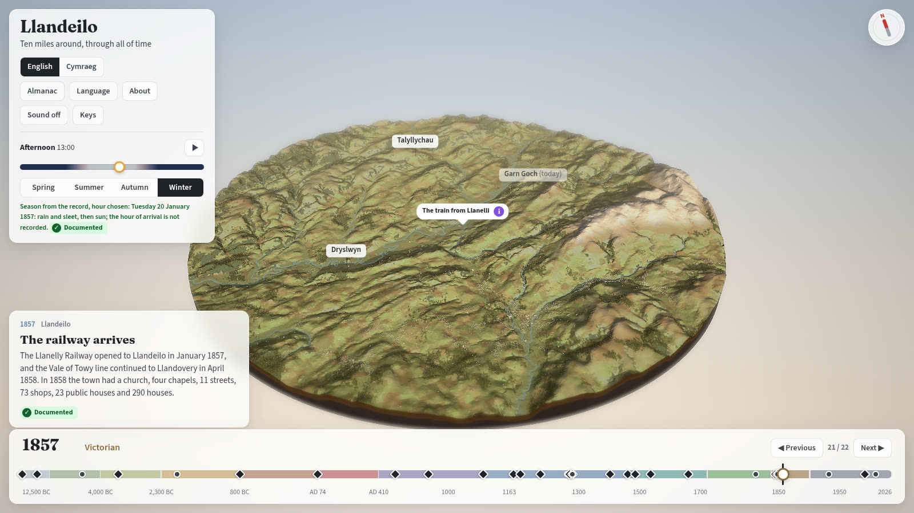
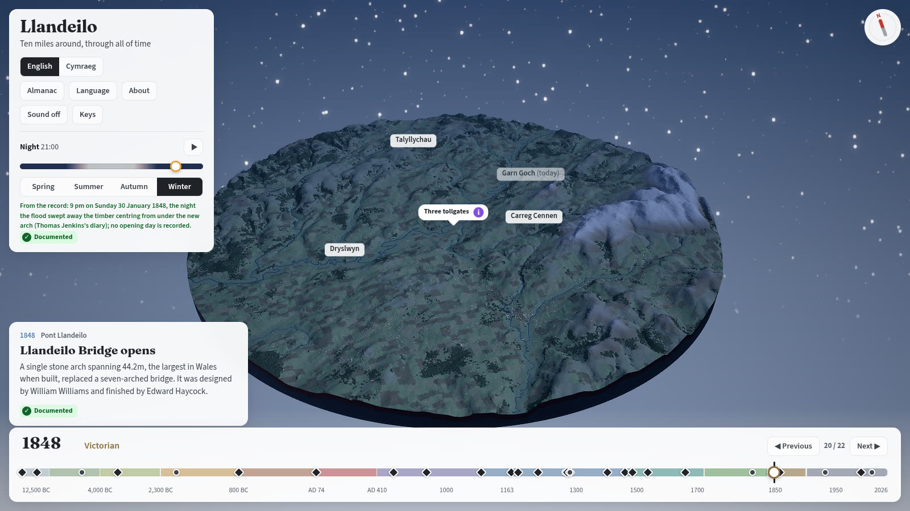

**More history corrected**, from independent checks of six more research notes (about 70 fixes in
the app):

- **12,500 BC was drawn as the coldest, barest moment.** Its dates had been read from uncalibrated
  pollen zones. In calendar years it is the warm part of the Late Glacial, with grass and juniper
  scrub.
- **The Dinefwr Roman forts** now have the primary report's sizes (240 by 160m and 140 by 110m), and
  only the smaller fort lasts into the 2nd century.
- **The Great Western took over the line in 1873**, not 1889.
- **The trilobite was found in 1698**, not 1688. Wolves were last mentioned in Wales in 1166 but
  probably lived on for another century or two.
- **Language:** Late Brittonic until about 550, then Primitive Welsh (Cymraeg Cyntefig), and modern
  Welsh from the 1400s.
- **Llandeilo's Welsh speakers:** about 45% in 2021, and the earlier figures are now labelled as
  ward figures, not the town's.
- **No page counts twice:** places that cited one web page under two references, which made them
  look like two sources, now cite it once.

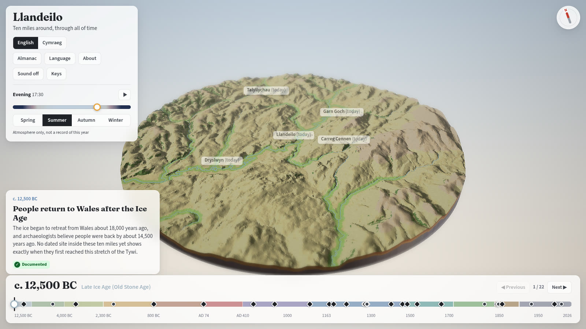
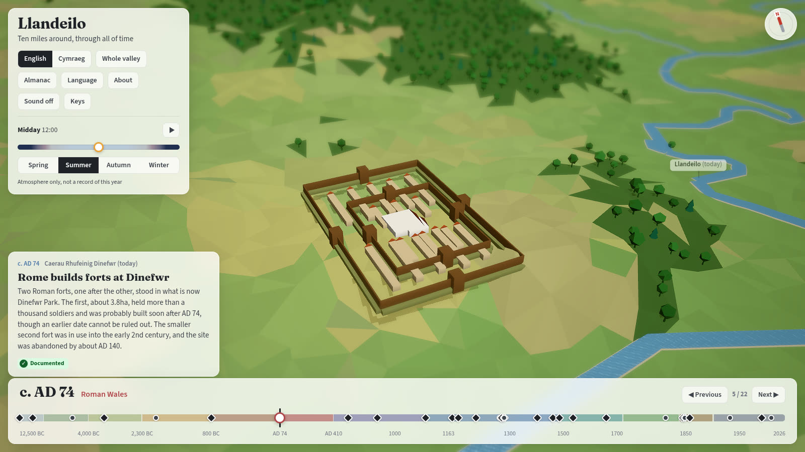
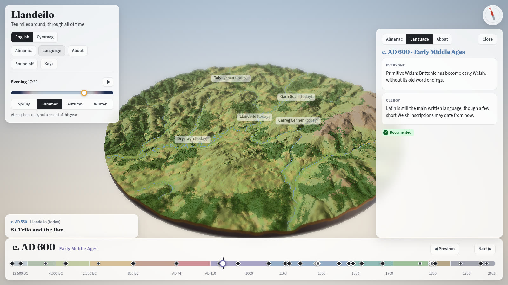

**Smoother.** On a real graphics card, scrubbing the timeline went from about 2 to about 15 frames a
second. Every step used to recolour the whole landscape and redraw every shadow; now that waits until
the slider settles.

## v0.2.0 (2026-10-02): checked history, rebuilt abbey and castle, and a keys panel

**Open the app:** https://dewijones92.github.io/llandeilo-omnia-mutantur-nihil-interit/

**History corrected.** Every research note behind the app's three main eras was re-read against its
sources by an independent check, and what was wrong is now fixed in the app:

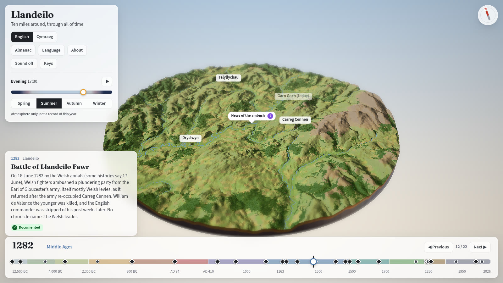

- **1282, the Battle of Llandeilo Fawr:** the date is 16 June by the Welsh annals (some histories say
  17 June). The English force had not sacked Carreg Cennen: the army re-occupied walls the Welsh had
  already burnt, and the ambushed men were a plundering party from an army mostly of Welsh levies.
- **1287, the siege of Dryslwyn:** a mined wall fell on the men inspecting the mine; it was not a
  tunnel collapse. The castle had fallen by 5 September.
- **1403, Glyndŵr:** Owain himself lodged a night in Llandeilo, and a letter of mid-July says the
  rebels had burned Llandeilo and Newtown. Dinefwr seems to have held; whether Carreg Cennen fell is
  disputed, and the app now says so.
- **Dinefwr:** no source gives 1163 for the Lord Rhys's castle, so that key date is now c. 1172, when
  "a castle in the new style" was begun.
- **Gerald of Wales** on what the Welsh ate is now quoted from his own words.
- **The Welsh text had quietly lost facts.** Sixteen places dropped a number, a date or a "probably"
  that the English kept; all are restored.

**Rebuilt from the evidence.**

- **Talley Abbey** stands on its real spot (Coflein's grid reference) and is drawn as it was built,
  about 49m long rather than the 73m planned, with only four bays of nave. After 1536 its east end
  serves as the parish church until 1773, while the rest decays.

  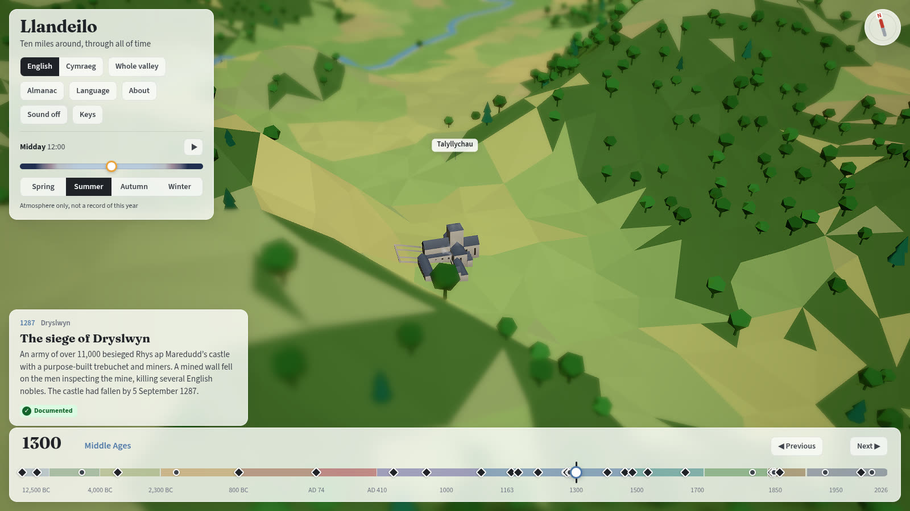
  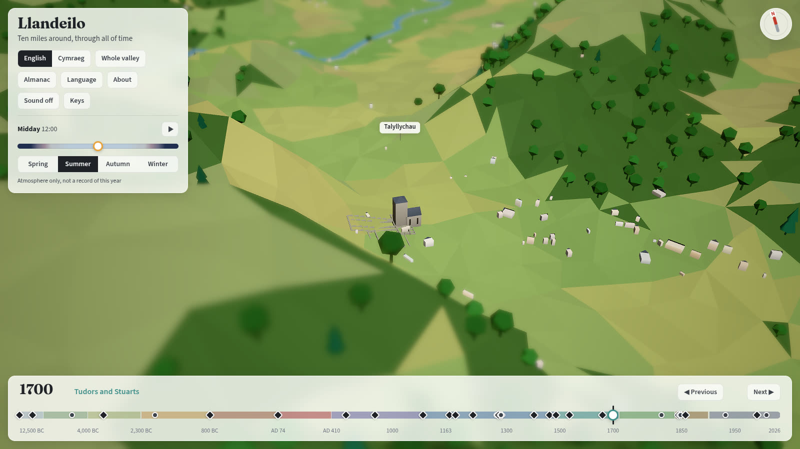
- **Dryslwyn Castle** grows ward by ward: the first ward of the 1220s, the middle ward in the
  mid-13th century, then the outer ward and gatehouse before the siege of 1287.

  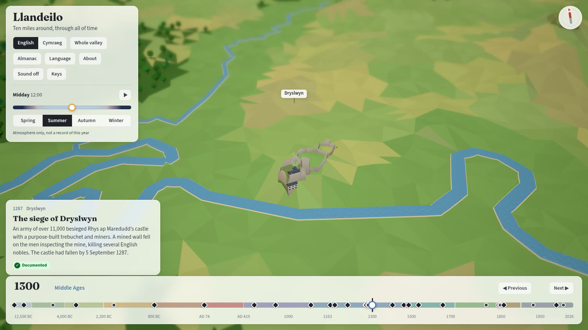

**Easier to use.**

- Press **?** or **Keys** for every shortcut and control.

  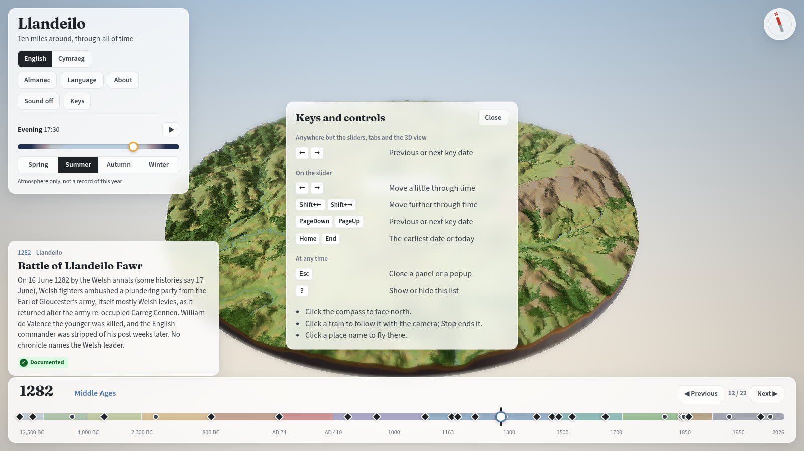

- Arrow keys step between key dates from almost anywhere.
- Place names no longer hide under panels or sit on each other, and the place a key date is about
  wins.
- A name that is anachronistic says "(today)", now on the key-date card too (the Roman forts' name is
  modern).

  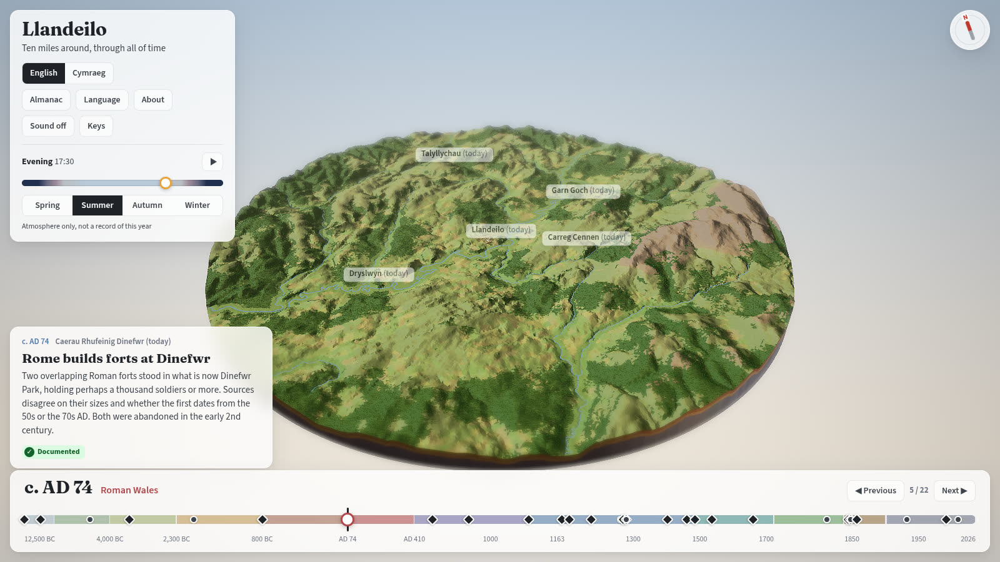

- The About panel says exactly what is drawn larger than life.
- Welsh conversations say that the voice has a standard accent, not the local southern speech.

